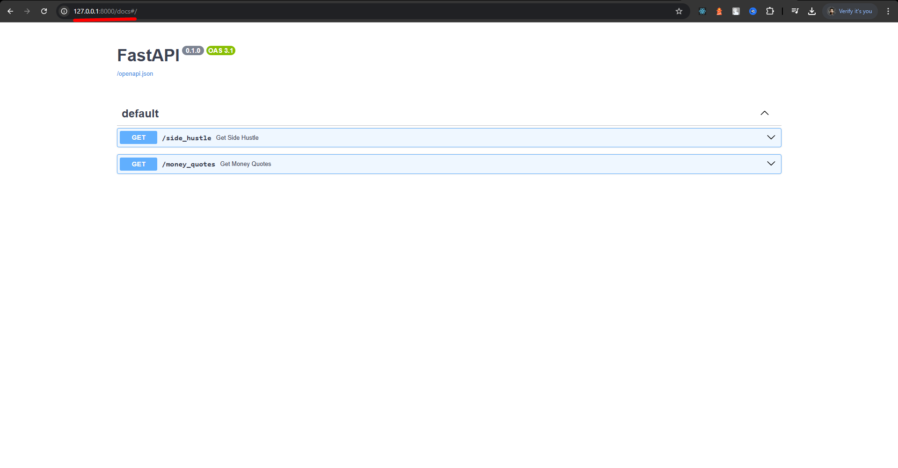

# Simple API

A simple API built with Python, UV, and FastAPI.

## Getting Started

### 1️⃣ Install UV

First, install **UV** (if not already installed):

```sh
curl -LsSf https://astral.sh/uv/install.sh | sh
```

For Windows:

```sh
powershell -ExecutionPolicy ByPass -c "irm https://astral.sh/uv/install.ps1 | iex"
```

Verify installation:

```sh
uv --version
```

---

### 2️⃣ Create and Initialize the Project

```sh
uv init simple-api
cd simple-api
```

---

### 3️⃣ Install FastAPI (Dependency)

```sh
uv add fastapi[standard]
```

---

### 4️⃣ Activate UV Virtual Environment (Windows)

```sh
.venv\Scripts\activate
```

For Linux/macOS:

```sh
source .venv/bin/activate
```

---

### 5️⃣ Run Simple API

```sh
fastapi dev main.py
```

### 6️⃣ Test the API

Paste the following into your browser:

```sh
http://127.0.0.1:8000/side_hustles
http://127.0.0.1:8000/money_quotes
```

or via Swagger UI:

```sh
http://127.0.0.1:8000/docs
```

## Swagger UI

**Swagger UI in FastAPI** is an **interactive API documentation** that allows developers to visualize and test API endpoints easily.

### How it Works

- **FastAPI automatically generates Swagger UI** for your API when you run the application.
- It provides a **user-friendly interface** to send requests and see responses without using external tools like Postman.
- You can access it by default at:

```sh
http://127.0.0.1:8000/docs
```

### Why is it Useful?

- Helps developers **understand and communicate with the API**.
- Allows users to **test API endpoints** directly from the browser.
- Auto-generates documentation based on FastAPI's **type hints and docstrings**.



🎉 That’s it! Your Simple API is ready to use 🚀
