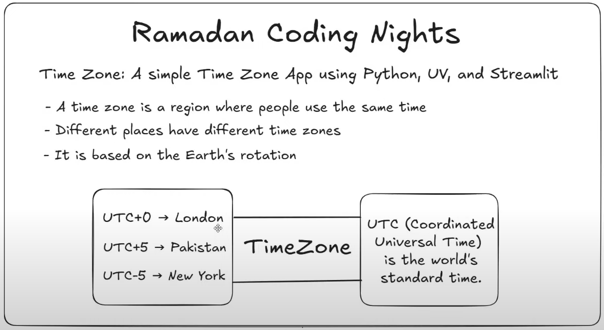
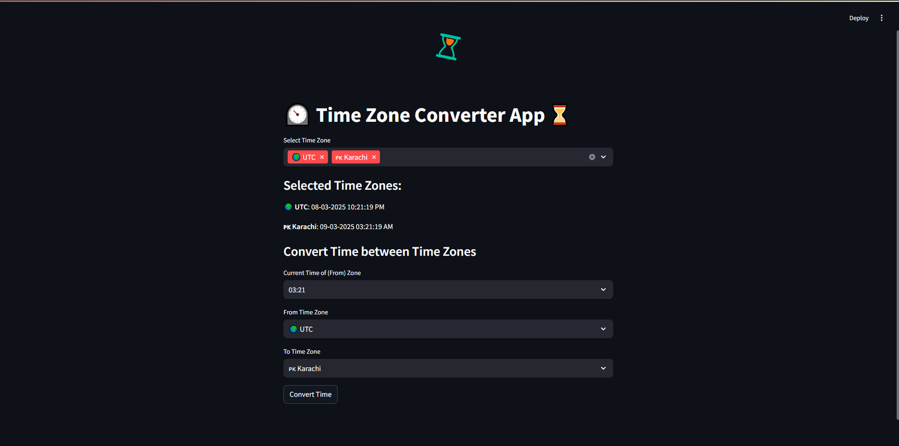

# Time Zone App

A simple time zone app built with Python, UV, and Streamlit.



## Getting Started

### 1️⃣ Install UV

First, install **UV** (if not already installed):

```sh
curl -LsSf https://astral.sh/uv/install.sh | sh
```

For Windows:

```sh
powershell -ExecutionPolicy ByPass -c "irm https://astral.sh/uv/install.ps1 | iex"
```

Verify installation:

```sh
uv --version
```

---

### 2️⃣ Create and Initialize the Project

```sh
uv init time-zone-app
cd time-zone-app
```

---

### 3️⃣ Install Sreamlit (Dependency)

```sh
uv add streamlit
```

---

### 4️⃣ Activate UV Virtual Environment (Windows)

```sh
.venv\Scripts\activate
```

For Linux/macOS:

```sh
source .venv/bin/activate
```

---

### 5️⃣ Run Time Zone App

```sh
streamlit run main.py
```

🎉 That’s it! Your Time Zone App is ready to use 🚀

## Final Product Image



**Live App** [Time Zone App](https://timezoneapp-ramadancoding-day06.streamlit.app/)
